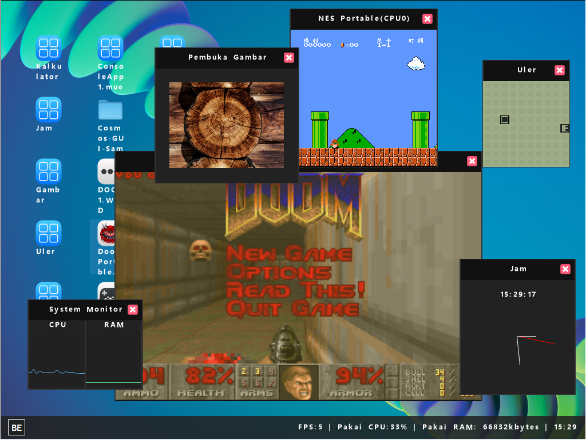

    

# BEOS

BEOS (**B**uitenzorg **E**mbedded **O**perating **S**ystem ) adalah OS x64 yang dibuat dengan bahasa C# dan compiler .NET 7 Native AOT technology.

## Building
Buka dengan visual studio 2022, run project BEOS 

### Build requirements
- VMware Workstation Player - https://www.vmware.com/products/workstation-player.html
- Visual studio 2022 - https://visualstudio.microsoft.com/
- QEMU - https://www.qemu.org/download atau VMWare ( Note - USB tidak berfungsi dengan VMWare dan butuh CPU x64, 32 bit tidak di dukung )
- Windows 10-11 x64 or x86
- A CPU minimum keluaran 2012 atau lebih baru, atau dengan tipe Ivy Bridge atau lebih baru
- 4GB RAM tapi 8GB lebih rekomen

 

 

## Features

| Feature | Working in VM | Working on hardware | Information |
| ------- | ------------- | ------------------- | ----------- |
| Applications .mue (BEOS User Executable) | 🟩 | 🟩 |
| Error Throwing / Catching | 🟥 | 🟥 | 
| GC | 🟨 | ⬜ | Not safe |
| Multiprocessor | 🟩 | 🟩 |
| Multithreading | 🟩 | 🟩 |
| PS2 Keyboard/Mouse(USB Compatible) | 🟩 | 🟩 |
| Nintendo Family Computer Emulator | 🟩 | 🟩 |
| DOOM(doomgeneric) | 🟩 | 🟩 |
| Intel® Gigabit Ethernet Network | 🟩 | 🟩 |
| Realtek RTL8139 | 🟩 | ⬜ |
| ExFAT | 🟩 | 🟩 |
| I/O APIC | 🟩 | 🟩 |
| Local APIC | 🟩 | 🟩 |
| SATA | 🟩 | ⬜ |
| IDE | 🟩 | 🟩 |
| SMBIOS | 🟩 | 🟩 |
| ACPI | 🟩 | 🟩 |
| IPv4 | 🟩 | 🟩 |
| IPv6 | 🟥 | 🟥 |
| UDP | 🟩 | ⬜ |
| Lan | 🟩 | 🟩 |
| Wan | 🟩 | 🟩 |

| Color Key | Meaning |
| ----- | ------- |
| 🟩 | Yes |
| 🟥 | No |
| 🟨 | W.I.P / Partially / Buggy |
| ⬜ | Unknown |
